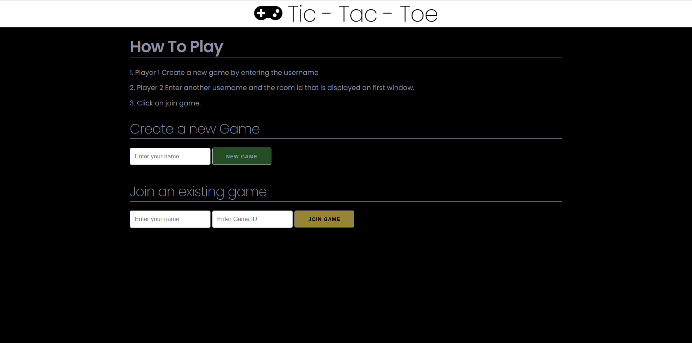
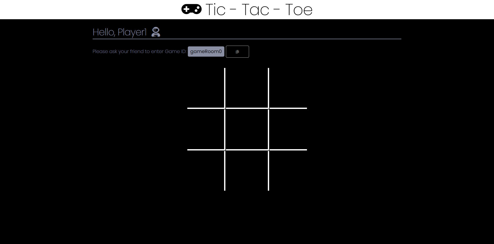

# Tic-Tac-Toe Multiplayer

Famous Tic-Tac-Toe game.

Technology used
a. Node Js
b. Socket.Io
c. Express
d. Skeleton css

To run this game locally:

1. Clone this repository

2. Run `npm install`

3. In the main.js file inside public directory change the socket connection to local connection(http://localhost:3000)

4. Run `npm start`

5. Go to http://localhost:3000/

## Screenshots
Landing page screenshot

Game board screenshot

